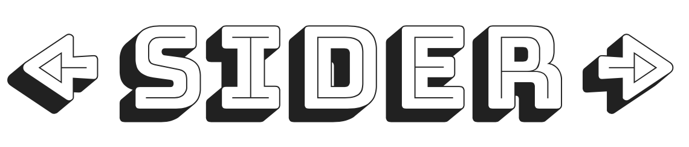

--------

Sider is research implementation of redis-like key-value storage. The goal of the project is to make the most efficient in-memory data structure store and conquer the world!  

**Desired features:**

- [x] Data structures: 
    - [x] strings, 
    - [x] lists,
    - [x] dicts

- [x] Per-key TTL
- [x] Operations:
    - Get
    - Set
    - Update
    - Remove
    - Keys

- [ ] Custom operations(Get i element on list, get value by key from dict, etc)
- [x] Golang API client
- [x] gRPC
- [x] Tests,
- [ ] API spec,
- [ ] deployment docs
- [ ] some examples of telnet/http calls to the server. 
  
**Additional features:**
- [x] persistence to disk/db
- [ ] scaling
- [x] SSL
- [x] auth
- [ ] perfomance tests

-----

### Building Sider

    $ make

### See also

Go-cache&nbsp;https://github.com/patrickmn/go-cache    
Redis&nbsp;&nbsp;&nbsp;&nbsp;&nbsp;&nbsp;&nbsp;&nbsp;https://github.com/antirez/redis  
BoltDB&nbsp;&nbsp;&nbsp;&nbsp;&nbsp;&nbsp;https://github.com/boltdb/bolt
